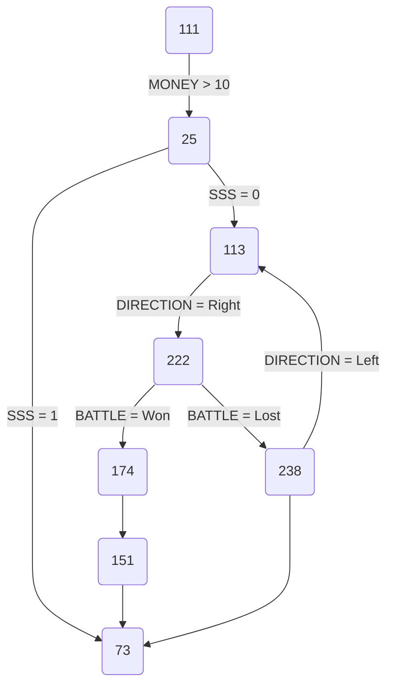

<!--suppress ALL -->

<p align="center">
    <a href="https://akademiaslaska.pl/" target="_blank">
        
    </a><br />
    <a href="https://www.yiiframework.com/" target="_blank">
        
    </a>

</p>

<h1 align="center">Niner Games Template Repository</h1><br />

This is a general overview. For technical information, follow to the [TECH.md](TECH.md) file. For legal stuff -- to [LICENSE.md](LICENSE.md).

This README file is very large. We keep all the technical stuff, information, tools etc. in here. This is intentional.
We don't want to put this information into Wiki (where it belongs). Wikis are available free of charge only in **public**
GitHub repos. While most of our repos, created based on this template, will be _private_.

This is a template repository that  contains information mostly on technical stuff etc. Feel free to rip off this  part 
(or any other in this document) and replace it with actual content about your repository.

- [Tools](#tools)
    * [Passwords and keys](#passwords-and-keys)
    * [JavaScript and JSON tools](#javascript-and-json-tools)
    * [Domains](#domains)
- [Diagrams](#diagrams)
    * [Example](#example)
    * [Source code](#source-code)
    * [Live editor](#live-editor)
    * [Mermaid Generator](#mermaid-generator)
    * [Other diagrams](#other-diagrams)
    * [Kroki.io service](#krokiio-service)
- [Releases](#releases)
- [Table of Contents](#table-of-contents)

This in-line ToC has been generated using [GitHub Wiki TOC generator](https://ecotrust-canada.github.io/markdown-toc/). 
For details, see [end of this document](#table-of-contents).

## Tools 

### Passwords and keys

If we need to generate some random password or key, the [RandomKeygen](https://randomkeygen.com/) service seems great!

Not only it generates **30+ passwords** at once (with each button press or browser refresh), but it also splits them by function (i.e. _strong passwords_, _memorable 
passwords_, _WPA_ or _WEP_ keys, etc.).

### JavaScript and JSON tools

Should any of our code include any piece of _JavaScript_ or _JSON_ we can consider these ones:

- JavaScript:
    * [ValidateJavaScript](https://validatejavascript.com/): as name says, good and challenging JavaScript linter
    * [JSCompress](https://jscompress.com/): strong JavaScript compressor (works on in-line code or uploaded files)
- JSONCompare: [beautify, minify, sort, save](https://jsoncompare.com/#!/simple/) (for sharing) and [lint](https://jsoncompare.com/#!/simple/) 
or [compare two sets](https://jsoncompare.com/#!/diff/) (can work on files)

Note that these are overloaded with ads. But, nothing is for free. Sorry, _taki mamy klimat_.

### Domains

"_Every good project starts with its own domain name and a logo_" (Tomasz Trejderowski)

Should we need to buy some nice, possibly cheap domain name, we can use [this AfterMarket link](https://www.aftermarket.pl/Market/List/?domain=&page=1&length1=&length2=&price1=&price2=777&price3=PLN&extension=&category=&type=listing&start1=&start2=&idn=0&seller=&bin=1&auction=-1&offers=1&hire=0&rental=-1&group=0&lastminute=0&is_catch=0&future=-1&_sort=price-&_count=300&_start=0).

It assumes domains:

- Not more expensive than **777 PLN**
- **Ready to purchase** (direct buy, no auctions)
- With full **ownership only** (no domain options, no domain lease)

And it displays all (most) results on a single page, sorted from cheapest to the most expensive ones.

## Diagrams

We can use [MermaidJS tool for JavaScript](https://mermaid.js.org/) across entire GitHub (in [issues](https://github.com/ninergames/test-renpy-engine/issues/23),
[discussions](https://github.com/ninergames/test-renpy-engine/discussions/21) and [in text files](https://github.com/ninergames/test-renpy-engine)).

### Example



The `73` item is clickable and points to → [https://mermaid.live/edit](https://mermaid.live/edit).

### Source code

Pure MermaidJS code needed to generate the above diagram is:

    flowchart TD
        A(111) -->|MONEY > 10| B(25)
        B --> |SSS = 1| C(73)
        B --> |SSS = 0| D(211)
        D --> |DIRECTION = Right| E(222)
        E -->|BATTLE = Won| F(174)
        E -->|BATTLE = Lost| G(238)    
        G --> C
        G --> |"DIRECTION = Left"| D(113)
        F --> H(151)
        H --> C
        click C href "https://mermaid.live/edit" "Mermaid Live Editor"

If you want to put it anywhere (issue, discussion, wiki) you simply embed it as any regular piece of code in Markdown, 
telling GitHub in the same time that this code is written in `mermaid` language:

    ```mermaid
        (the above MermaidJS code goes here)
    ```
You can see this in action, by [editing this page](https://github.com/akademia-slaska/template-repository/edit/main/README.md) 
and looking at its source code.

### Live editor

At <https://mermaid.live/edit> there's an on-the-fly editor which render MermaidJS code as you type it.

Unfold the _Actions_ section in the bottom-left corner to see some cools stuff like an ability to copy image to clipboard
or download it in PNG or SVG format, load MermaidJS code to selected Gist etc.

### Mermaid Generator

The [mermaid.ink Generator](https://mermaid.ink/) service is a great addition to above! You can feed it with MermaidJS code
and it will "convert" (render) it into an image. You'll get a regular URL pointing to an image, which you can embed anywhere
that you wish, i.e.:

- Use in GitHub as a static image instead of live editor
- Use it in any external tool, service or website etc.

To use URL-related functions, diagrams are first [encoded](https://docs.kroki.io/kroki/setup/encode-diagram/). This handled
by _mermaid.live_ Live Editor itself.

### Other diagrams

Flowchart diagram presented above is just one of many that MermaidJS supports.

The obvious ones (UML):

- [Sequence Diagram](https://mermaid.live/edit#pako:eNptkLFqAzEMhl9F0VrfC9yQUujQFDp1K16E_V_OYFuJY1NCyLvXd9ds0fQjfZ9AurFTDx75gnNDdngPciySbKZebzE4DPv9y6fOeaQPxKi0ZEOz_pIU0FXb61N4w5zkBaEZUijhH11mQ0eH1emLw2YbOqzGSndt9xw_0AREOhZI3bHhhJIk-H7FbREs1xkJlscePSZpsVq2-d5RaVW_r9nxWEuD4XbyUh9HP5rwoWr52h6z_sfwSfKPakcmiRfc_wC26mTi)
- [Class Diagram](https://mermaid.live/edit#pako:eNptkc9OwzAMxl8l8glE-wIVF8SYxGGn3aZKyE28LmrijPzRBGPvTlrWMDZySfyzP-uLfQTpFEED0mAIC429R9uyyOeJtUUjHr_qWiySHG7pUofdLd1Q5_EPbsSD5iiwp2u8jl5zL3piRf4yOUrCCm1-3t1fJSxGmuFke7J3_AGiNO0Ih2dnnC-JcNB2FubwPaEc5vh02W_8WOlXj96D_qRXXhLFgiXyC8Z_9dMIfg11zhmhw9tBG1WgT1y0UIElb1GrvIlJ10LckaUWmvxUtMVkYgstj6WYolt_sIQm-kQVpL3KEznvboakdHR-dV7ueFWwR944l0u2aAKdvgFIMZyC)
- [Simple State Machine Diagram](https://mermaid.live/edit#pako:eNpdjz0LgzAQhv-K3Fh06ejQpV2d3No4HObUQD4kXoQi_vemCdJipofn3gv3btA7SVDDwsj0UDh6NNV6FbaI73Xpiqq6FS0rrbNKmGQcnlXjVmXHbDOf1__s3eMyZZvw-BRKMOQNKhnP2r4BATyRIQF1REkDBs0ChN1jFAO79m17qNkHKiHM8lfkkCQVO9_kpqlwCTPap3MxMqBeaP8ArztTOA)

Some less often used:

- [Entity Relation Diagram](https://mermaid.live/edit#pako:eNp10VFrgzAQB_CvEu5Z-wF8KxqGMOeIttCRl8ycbUCNpLEw1O--WA1bO5a3HL_7J9yNUGmJEAGaRImzES3viDvxoSjzjDIyT7vdNJKEvqZHyk7hPkkYLQoSkYu4PtlpCkM9kpwl7hKRvhEV_mPSt2OextQpDo0Snw2SWhsOq_7z2lOywQrVzWf7rAVNP6jSNzQbWWu_QZiWNHNKdVUzSB_1zvLkEJdhvC_pS85OvmWr31M7K1T36B_-55M5aCPRoHRvcIAAWjStUNINe1y6OdgLtshhoRJrMTR2GcDsqBisLr66CiJrBgxg6KWwuG3IF1Eqq0227u--xgB60X1o7UgtmivO35Pxk64)
- [User Journey](https://mermaid.live/edit#pako:eNplULEKg0AM_ZWQ2aWULrdW6OTkVlyCl9arepEzR5HSf--pFSzNFN57eY-8F9ZiGQ0-JAbPU-UhjTrtGIoJnhJa5-9g6cuMXKsTDxcBlYVecYCCWgZlMnAyUPAGJ2EcRiUXRgPHPZOv9wYOM5rBmfQvo5F-72Tl6Tevn5TS6UJ-IzDDnkNPzqbPXrOoQm04eaFJq-UbxU4rrPw7SSmqlJOv0WiInGEcLCnnju6B-g1k61RCsZa1dJbhQP4qkiQ36kZ-fwCt22h_)
- [Pie Diagram](https://mermaid.live/edit#pako:eNo1j8sKwjAQRX8lzLobEaVka7eC6E6yGZtpDeRFMhFK6b8bLZnV5XDg3llhDJpAQjQk2LAlcSPOAnWITFq8FvEJtngmSll5UU_BEOasQEhx7M-NXZB31p8aujd0OEEHjpJDo2vV-hMU8JscKZA1apqwWFag_FZVLBweix9BcirUQYkamQaDc0LXIGnDIV339f8nOojonyFUZUKbafsCDfBG3g)

The [User Journey](https://mermaid.live/edit#pako:eNplULEKg0AM_ZWQ2aWULrdW6OTkVlyCl9arepEzR5HSf--pFSzNFN57eY-8F9ZiGQ0-JAbPU-UhjTrtGIoJnhJa5-9g6cuMXKsTDxcBlYVecYCCWgZlMnAyUPAGJ2EcRiUXRgPHPZOv9wYOM5rBmfQvo5F-72Tl6Tevn5TS6UJ-IzDDnkNPzqbPXrOoQm04eaFJq-UbxU4rrPw7SSmqlJOv0WiInGEcLCnnju6B-g1k61RCsZa1dJbhQP4qkiQ36kZ-fwCt22h_)-type 
diagram can be used in many scenarios. For example, to denote results of some poll etc. in more complex / other form than
[Pie Diagram](https://mermaid.live/edit#pako:eNo1j8sKwjAQRX8lzLobEaVka7eC6E6yGZtpDeRFMhFK6b8bLZnV5XDg3llhDJpAQjQk2LAlcSPOAnWITFq8FvEJtngmSll5UU_BEOasQEhx7M-NXZB31p8aujd0OEEHjpJDo2vV-hMU8JscKZA1apqwWFag_FZVLBweix9BcirUQYkamQaDc0LXIGnDIV339f8nOojonyFUZUKbafsCDfBG3g)
offers.

All mentioned diagram types can be used anywhere within GitHub (in [issues](https://github.com/ninergames/test-renpy-engine/issues/23), [discussions](https://github.com/ninergames/test-renpy-engine/discussions/21) and [even in text files](https://github.com/ninergames/test-renpy-engine)).

### Kroki.io service

We can use this service for:

- All other diagram types that MermaidJS doesn't support
- All diagrams that for some reason we want to generate in other language than MermaidJS

In this case we will end up with the generated static image, which we must paste directly to GitHub.

Some other diagrams (not available in MermaidJS) that are worth considering includes:

- [MindMap diagram in PlantUML](https://kroki.io/examples.html#mind-map) (looks better than the one generated in MermaidJS)
- [Syntax diagram in Pikchr](https://kroki.io/examples.html#syntax)
- [Container diagram in C4 PlantUML](https://kroki.io/examples.html#c4-container) (for drawing system architectures)
- [Component diagram in C4 PlantUML](https://kroki.io/examples.html#c4-component) (can be used for drawing nearly everything)
- [Word Cloud diagram in Vega](https://kroki.io/examples.html#word-cloud) (more-like for marketing issues etc.)

And many more. Kroki.io supports [20+ languages](https://kroki.io/#support) and for certain languages (but not for MermaidJS)
it allows rendering diagrams in PDF or TXT formats or as base64-encoded streams.

## Releases

All the details are given in [Git Basics - Tagging](https://git-scm.com/book/en/v2/Git-Basics-Tagging) and [Managing releases in a repository](https://docs.github.com/en/repositories/releasing-projects-on-github/managing-releases-in-a-repository).

In short:

1. Make a tag:
    * For exiting commit:
        * List all commits: `git log --pretty=oneline`
        * Pick the one you wish to tag (first seven letters of the has are enough), i.e.: `32c274c`
        * Add a tag: `git tag -a 0.1 32c274c -m "First version before general refactor"`
    * For latest commit: `git tag -a 1.4 -m "My version 1.4"`
    * Please, **do not** use `v1.0` scheme;
        * A version is a version, no need to prepend number with `v`
        * Even if [GitHub claims](https://github.com/akademia-slaska/template-repository/releases/new) that this is a common practice to do so
    * Use [Semantic Versioning 2.0.0](https://semver.org/) (three numbers) whenever possible
2. Push tag(s) to GitHub: `git push --tags`
3. Create [a new release](https://github.com/akademia-slaska/template-repository/releases/new): pick a tag, add title and a description, add some binaries, set options
4. Publish a release or save it as a draft.

GitHub **always adds a source code** to release. We **must always treat** all our releases **purely as private**.

Note that `git push --tags` pushes tags **only**. If you have some unpushed commits in the same time, you should send them next, using regular `git push`.

## Table of Contents

As you can see, this README file is really long, logically separated into many sections and subsections. We need to have 
an option to generate table of contents in such case.

GitHub handles this for us. It auto-generates TOCs [for README file](https://github.blog/changelog/2021-04-13-table-of-contents-support-in-markdown-files/)
and for [Wiki pages](https://twitter.com/github/status/1428466581554745352).

You can browse contests of this document by clicking the _Contents_ button to the left of this document title:


Or you can get a [manually-generated in-line TOCs](https://ecotrust-canada.github.io/markdown-toc/) and copy-paste it to
and file, issue, doc or text.